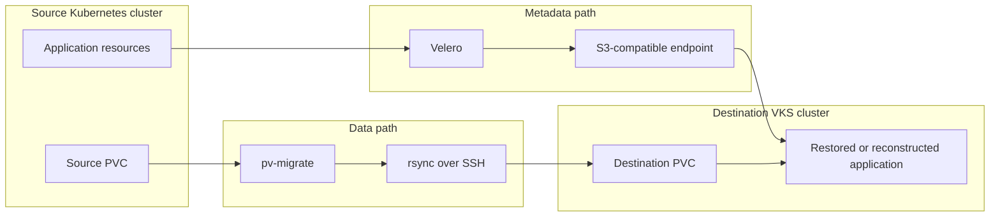

# Kubernetes to VKS Migration using pv-migrate

## Overview

This validated solution demonstrates how to migrate a stateful application from another Kubernetes distribution to VMware vSphere Kubernetes Service (VKS).

The solution separates migration into two independent paths:

- **Application metadata** is captured and restored using Velero.
- **Persistent volume data** is copied directly from the source PVC to a pre-created destination PVC using `pv-migrate`.

This differs from the companion vSphere CSI capture workflow, which preserves and re-registers an existing First Class Disk. The `pv-migrate` approach performs a filesystem-level copy and therefore works across different clusters, vCenters, CSI implementations and storage policies, provided that both volumes can be mounted by the migration pods.

Typical source platforms include:

- Red Hat OpenShift
- Rancher-managed Kubernetes
- Upstream Kubernetes
- Other CNCF-conformant Kubernetes distributions

> [!IMPORTANT]
> This solution is an example migration pattern, not a substitute for application-specific backup, consistency and recovery procedures. Test the complete workflow and rollback process before using it with production data.

## Architecture



The two paths are deliberately decoupled:

1. Velero captures portable Kubernetes resources.
2. PVs, PVCs and snapshots are excluded from the Velero backup.
3. A destination PVC is created using a VKS-compatible StorageClass.
4. `pv-migrate` copies the filesystem contents into that PVC.
5. The application is restored or reconstructed and attached to the destination claim.

## Why storage resources are excluded from Velero

The destination PVC is provisioned independently using a VKS StorageClass. Restoring the source PV or PVC would preserve source-specific binding information and could conflict with the destination volume created for `pv-migrate`.

A manifests-only backup therefore excludes storage objects:

```bash
velero backup create "${BACKUP_NAME}" \
  --include-namespaces "${SRC_NAMESPACE}" \
  --include-cluster-resources=false \
  --snapshot-volumes=false \
  --exclude-resources \
persistentvolumes,persistentvolumeclaims,volumesnapshots.snapshot.storage.k8s.io,volumesnapshotcontents.snapshot.storage.k8s.io
```

Application-specific PVC labels and annotations that must be retained should be recorded during discovery and applied to the destination PVC explicitly.

## Migration phases

### Phase 1: Discovery

Record:

- Source namespace, workload and PVC names
- PVC sizes, access modes and `volumeMode`
- StorageClass and CSI provisioner
- PVC labels and portable annotations
- Helm release name, chart version and values
- Application quiesce and restart procedure
- Service, Ingress, Route and registry translations
- SecurityContext, SCC and Pod Security requirements
- Source-to-destination network path

### Phase 2: Prepare the destination

Create the destination namespace and PVC before restoring the application.

The destination PVC must:

- Be at least as large as the source PVC
- Use a valid VKS StorageClass
- Use a compatible access mode
- Use the same `volumeMode`
- Remain unmounted during the copy unless the consequences are understood

See [`manifests/destination-pvc.yaml`](manifests/destination-pvc.yaml).

### Phase 3: Capture application metadata

Create a Velero backup that excludes storage resources. Restore the application metadata into a staging namespace or use resource modifiers to prevent workloads from starting before the data copy is complete.

For Helm-managed applications, prefer reconstructing the release from the original chart and recorded values rather than treating rendered Kubernetes objects as the authoritative release definition.

### Phase 4: Initial data copy

An initial copy may be performed while the source application is still running when the application and filesystem permit it. This reduces the amount of data transferred during the final outage.

The initial copy is not, by itself, application-consistent.

### Phase 5: Cutover

1. Stop external writes.
2. Quiesce or stop the application.
3. Confirm that no source workload is writing to the PVC.
4. Run a final `pv-migrate` copy.
5. Validate the destination data.
6. Restore or scale up the destination application.
7. Validate application functionality.
8. Redirect traffic.

### Phase 6: Retention and rollback

Retain the source workload and PVC until the destination has passed the agreed validation period.

Rollback normally consists of:

1. Stop destination writes.
2. Redirect traffic to the source.
3. Restart the source application.
4. Investigate or repeat the migration.

Do not delete the source PVC merely because the destination application has started successfully.

## pv-migrate strategy

For cross-cluster migrations, the primary strategies are:

- `loadbalancer`: exposes the SSH endpoint using a LoadBalancer Service.
- `nodeport`: exposes a selected NodePort and requires suitable routing and firewall rules.
- `local`: tunnels through the operator workstation; useful when direct connectivity is not possible, but less suitable for large transfers.
- `--rsync-push`: reverses the default rsync direction so the source initiates the connection to the destination.

The validated OpenShift-to-VKS pattern uses `--rsync-push`. This is useful when the source cluster should not expose an inbound migration service.


The destination VKS cluster therefore needs a reachable LoadBalancer address. The source cluster only requires outbound reachability to that address.

## Security considerations

Start with the least-privileged configuration that can read the source and write the destination.

`pv-migrate --non-root` is suitable only when:

- Source files are readable by the non-root migration user
- The destination filesystem is writable by that user
- Preserving original ownership is not required

Some OpenShift-hosted volumes contain root-owned data that cannot be copied using non-root mode. In the validated proof of concept, the source rsync pod required an appropriate SCC and ran as UID 0. Treat this as an explicit, temporary exception:

- Limit it to the migration namespace and ServiceAccount
- Remove the SCC assignment after migration
- Inspect generated manifests before applying overrides
- Do not grant broad privileged access to the application workload

See [`OPENSHIFT.md`](OPENSHIFT.md).

## Files

| File | Purpose |
|---|---|
| [`examples.md`](examples.md) | Detailed step-by-step example |
| [`OPENSHIFT.md`](OPENSHIFT.md) | OpenShift SCC and root-owned data considerations |
| [`troubleshooting.md`](troubleshooting.md) | Common failures and diagnostic commands |
| [`scripts/pv-migrate-poc.sh`](scripts/pv-migrate-poc.sh) | Concise proof-of-concept orchestration script |
| [`manifests/destination-pvc.yaml`](manifests/destination-pvc.yaml) | Destination PVC template |
| [`manifests/velero-resource-modifier.yaml`](manifests/velero-resource-modifier.yaml) | Example restore modifier to keep workloads stopped |

## Validation checklist

- [ ] Velero backup completed without unexpected warnings or errors
- [ ] Destination PVC is `Bound`
- [ ] Source and destination PVC sizes and modes are compatible
- [ ] Source application was quiesced for the final copy
- [ ] `pv-migrate` completed successfully
- [ ] File count and application-specific checks agree
- [ ] Destination application references the intended PVC
- [ ] Pods are healthy
- [ ] Services and ingress are reachable
- [ ] Helm or package-manager state is healthy
- [ ] Source PVC is retained for rollback
- [ ] Temporary migration privileges and resources are removed

## Limitations

- `pv-migrate` copies mounted filesystem contents; it does not migrate raw block volumes.
- A live initial copy is not automatically application-consistent.
- File ownership and extended metadata depend on the rsync mode and permissions available to the migration pod.
- Transfer time depends on data volume, file count, storage performance and network bandwidth.
- The destination PVC must be provisioned before the copy.
- Application manifests may require translation between Kubernetes distributions.
- `pv-migrate` is a third-party open-source project and should be evaluated under the organisation's software support and security policies.

## References

- `pv-migrate`: <https://github.com/utkuozdemir/pv-migrate>
- Velero: <https://velero.io/>
