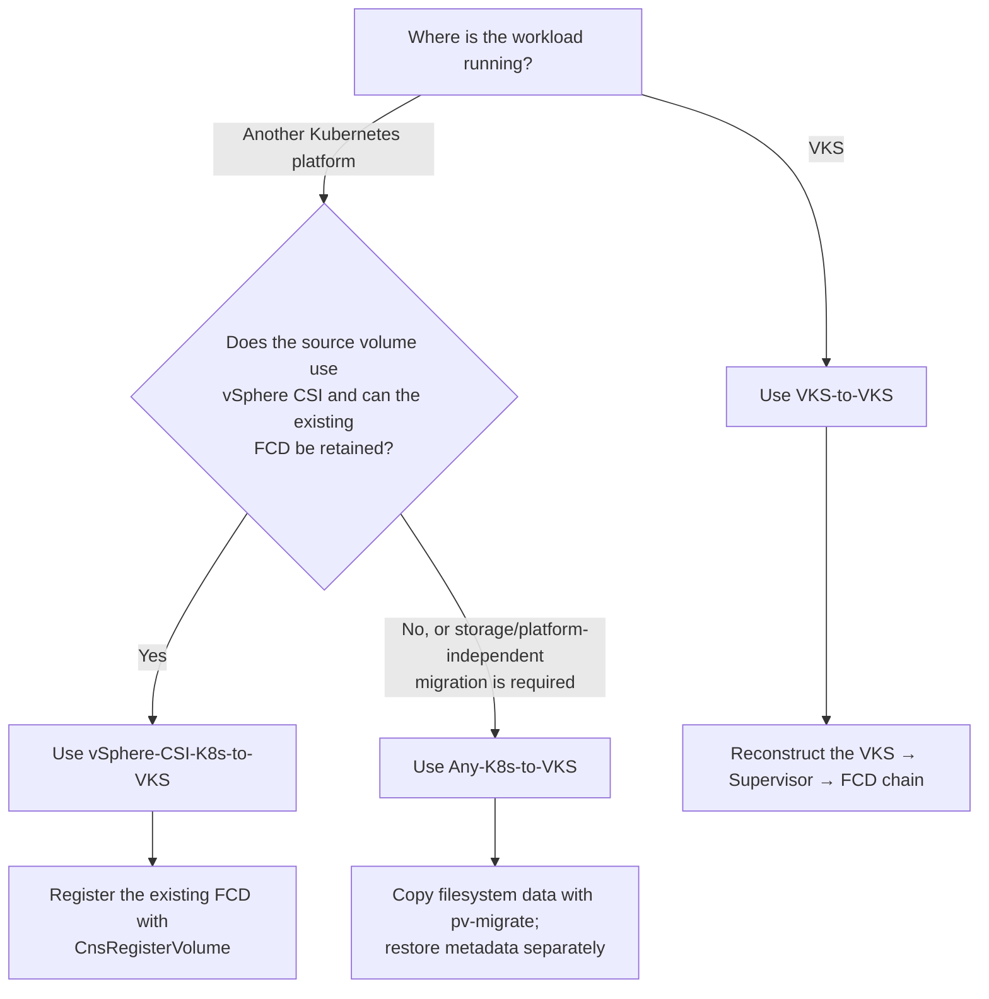
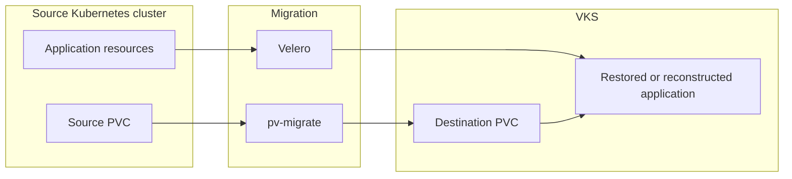
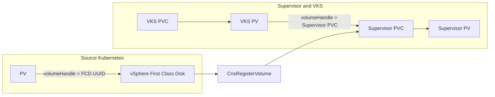
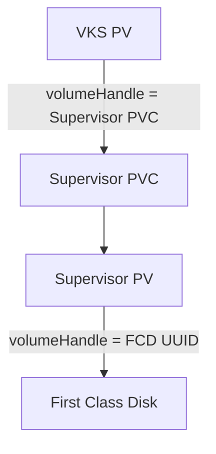

# VMware vSphere Kubernetes Service (VKS) Migrations

This directory contains validated patterns, worked examples and supporting scripts for migrating stateful Kubernetes workloads to, and between, VMware vSphere Kubernetes Service (VKS) clusters.

The solutions address three different migration scenarios:

1. Copying persistent data from a general Kubernetes platform to VKS.
2. Reusing an existing vSphere CSI First Class Disk when moving to VKS.
3. Re-adopting an existing VKS volume in another VKS cluster or vCenter.

The correct approach depends primarily on the source platform, the storage driver and whether the existing vSphere First Class Disk can be preserved.

> [!IMPORTANT]
> These solutions demonstrate migration mechanisms and validation procedures. Application consistency, downtime, rollback and support requirements must be assessed for each workload before production use.

## Choose a Migration Approach

| Source | Destination | Data movement | Recommended solution |
|---|---|---:|---|
| OpenShift, Rancher, upstream Kubernetes or another CNCF-conformant cluster | VKS | Filesystem copy using `pv-migrate` | [`Any-K8s-VKS-pv-migrate`](Any-K8s-VKS-pv-migrate/) |
| Kubernetes using the vSphere CSI driver | VKS | No filesystem copy; existing FCD is registered with the Supervisor | [`vSphere-CSI-K8s-to-VKS-cnsRegisterVolume`](vSphere-CSI-K8s-to-VKS-cnsRegisterVolume) |
| VKS | Another VKS cluster, Supervisor namespace or vCenter | No filesystem copy; the VKS/Supervisor storage chain is reconstructed | [`VKS-to-VKS-cnsRegisterVolume-and-vMotion`](VKS-to-VKS-cnsRegisterVolume-and-vMotion/) |

## Decision Guide



## Migration Solutions

### Any Kubernetes to VKS

[`Any-K8s-VKS-pv-migrate`](Any-K8s-VKS-pv-migrate/) is the portable migration path.

It separates migration into two independent streams:

- **Application metadata** is captured and restored using Velero or reconstructed from the original deployment method.
- **Persistent data** is copied from the source PVC to a pre-created VKS PVC using `pv-migrate`.



Use this approach when:

- The source is OpenShift, Rancher, upstream Kubernetes or another Kubernetes distribution.
- The source and destination use different CSI drivers or storage policies.
- The existing source disk cannot or should not be adopted directly.
- A storage-independent migration method is required.

Because the data is copied at the filesystem layer, transfer time depends on data size, file count, storage performance and network bandwidth.

---

### vSphere CSI Kubernetes to VKS

[`vSphere-CSI-K8s-to-VKS-cnsRegisterVolume`](vSphere-CSI-K8s-to-VKS-cnsRegisterVolume/) preserves an existing vSphere First Class Disk and registers it with the destination Supervisor using `CnsRegisterVolume`.



Use this approach when:

- The source cluster uses the vSphere CSI driver.
- The source PV maps directly to a vSphere FCD.
- The disk can be detached from the source cluster and made available to the destination Supervisor.
- Avoiding a filesystem data copy is preferable.

This method changes the ownership and Kubernetes metadata around the disk; it does not copy the application data.

---

### VKS to VKS

[`VKS-to-VKS-cnsRegisterVolume-and-vMotion`](VKS-to-VKS-cnsRegisterVolume-and-vMotion/) migrates an existing VKS volume by preserving the FCD and reconstructing the VKS and Supervisor storage relationship.



Use this approach when migrating:

- Between VKS clusters on the same Supervisor.
- Between Supervisor namespaces.
- Between Supervisors.
- Across vCenters, with the FCD moved using cross-vCenter Storage vMotion and registered on the destination.

The underlying data remains on the existing FCD. Only the surrounding Kubernetes storage objects are re-created.

## Comparing the Approaches

| Characteristic | Any-K8s-to-VKS | vSphere-CSI-K8s-to-VKS | VKS-to-VKS |
|---|---|---|---|
| Source requirement | Kubernetes with mountable filesystem PVCs | vSphere CSI-backed Kubernetes | VKS |
| Data handling | Filesystem copy | Existing FCD retained | Existing FCD retained |
| Primary data tool | `pv-migrate` / rsync | `CnsRegisterVolume` | Supervisor storage reconstruction and, where required, `CnsRegisterVolume` |
| Metadata handling | Velero and/or deployment reconstruction | Velero and static VKS PV/PVC | Static Supervisor and VKS storage objects |
| Storage independence | High | vSphere-specific | VKS/vSphere-specific |
| Typical downtime driver | Final data synchronisation | Application quiesce and disk detach | Application quiesce and storage-chain reconstruction |
| Cross-vCenter support | Yes, by copying data | Possible when the FCD is made available to the destination | Yes, using FCD migration and destination registration |
| Best fit | Broad platform portability | Zero-copy capture of a vSphere CSI disk | Zero-copy movement between VKS environments |

## Common Migration Principles

Although the mechanisms differ, each solution follows the same operational principles.

### Discover before migrating

Record:

- Workloads and namespaces
- PVCs, access modes and volume modes
- StorageClasses and CSI provisioners
- Helm releases and values
- SecurityContext, SCC or Pod Security requirements
- Application dependencies and external integrations
- Quiesce, validation and rollback procedures

### Separate application metadata from persistent data

Kubernetes resources and persistent data have different portability constraints. The solutions therefore handle them independently:

- Velero or the original package manager handles application metadata.
- The selected storage migration mechanism handles persistent data.
- Source-specific PV and PVC objects are not blindly restored into VKS.

### Quiesce for the final cutover

A crash-consistent copy or preserved disk is not necessarily application-consistent. Use the application's supported shutdown, checkpoint or backup process before the final migration step.

### Validate before removing the source

At minimum, confirm:

- Destination PVCs are `Bound`.
- Pods are healthy.
- Application data is present and writable.
- Services and ingress are reachable.
- Authentication and external integrations function.
- Helm or package-manager state is healthy.
- The agreed rollback window has elapsed.

## Repository Layout

```text
VKS-Migrations/
├── README.md
├── Any-K8s-VKS-pv-migrate/
│   ├── README.md
│   ├── examples.md
│   ├── OPENSHIFT.md
│   ├── troubleshooting.md
│   ├── manifests/
│   └── scripts/
├── vSphere-CSI-K8s-to-VKS-cnsRegisterVolume/
│   ├── README.md
│   ├── OCP-VKS-migration-example.md
│   ├── manifests/
│   └── scripts/
└── VKS-to-VKS-cnsRegisterVolume-and-vMotion/
    ├── README.md
    ├── examples.md
    └── scripts/
```

Individual solution directories may contain additional manifests, helper scripts and platform-specific notes.

## Support and Validation

The examples in this repository should be treated as validated solution patterns rather than universally applicable production automation.

Before use:

1. Confirm compatibility with the source and destination Kubernetes, VKS, vCenter and CSI versions.
2. Review third-party tools under the organisation's software support and security policies.
3. Rehearse the migration and rollback process using representative data.
4. Confirm storage-policy, networking, security and quota requirements.
5. Retain an application-consistent backup independently of the migration mechanism.

## Contributing

Contributions should:

- Explain the migration scenario and assumptions.
- Keep discovery, migration, validation and cleanup steps distinct.
- Avoid embedding environment-specific credentials or identifiers.
- Include rollback considerations.
- Prefer configurable examples over hard-coded values.
- Clearly identify proof-of-concept or version-specific behaviour.
