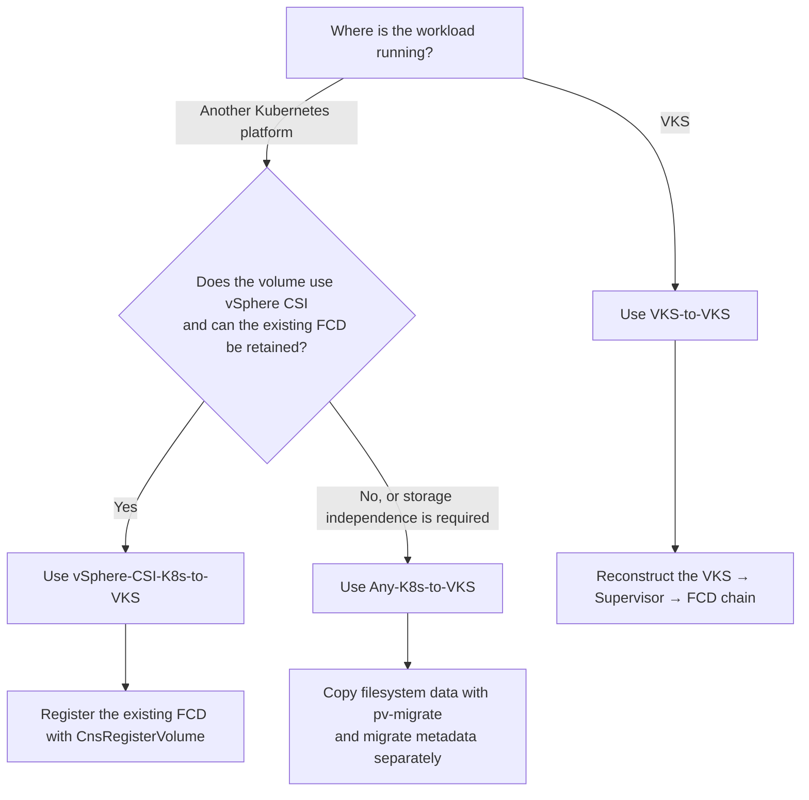
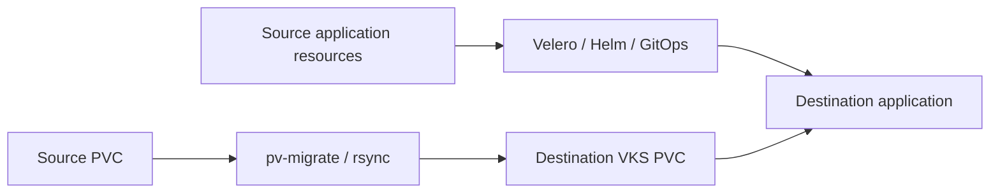
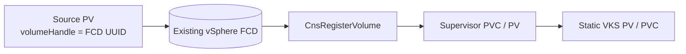
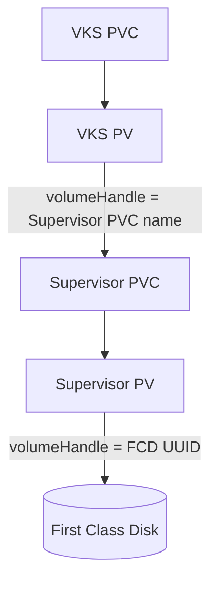

# VMware vSphere Kubernetes Service (VKS) Migrations

This directory contains migration patterns, worked examples and supporting scripts for moving stateful Kubernetes workloads to, and between, VMware vSphere Kubernetes Service (VKS) clusters.

Three approaches are provided. The correct choice depends on the source platform, its storage driver, and whether the existing vSphere First Class Disk (FCD) can be preserved.

> [!IMPORTANT]
> These examples demonstrate migration mechanisms rather than universally applicable production automation. Assess application consistency, downtime, rollback, security, and product-version compatibility for each workload.

## Choose a migration approach

| Source | Destination | Persistent-data method | Solution |
|---|---|---|---|
| A Kubernetes cluster with a mountable filesystem PVC | VKS | Copy the filesystem into a newly provisioned VKS PVC using `pv-migrate` | [`Any-K8s-to-VKS`](Any-K8s-to-VKS/) |
| A Kubernetes cluster using the vSphere CSI driver | VKS | Retain the existing FCD and register it with the destination Supervisor | [`vSphere-CSI-K8s-to-VKS`](vSphere-CSI-K8s-to-VKS/) |
| VKS | Another VKS cluster, Supervisor namespace, or vCenter | Preserve the FCD and reconstruct the VKS/Supervisor storage chain | [`VKS-to-VKS`](VKS-to-VKS/) |

## Decision guide

## Migration approaches

### Any Kubernetes to VKS

[`Any-K8s-to-VKS`](Any-K8s-to-VKS/) is the portable filesystem-copy approach.

It separates migration into two paths:

- **Application metadata** is restored with Velero or reconstructed using Helm, GitOps, or the original deployment process.
- **Persistent data** is copied from the source PVC into a pre-created VKS PVC using `pv-migrate` and `rsync`.

Use this approach when the source and destination use different storage systems, the original disk cannot be adopted directly, or storage-platform independence is required.

The source and destination must expose compatible filesystem PVCs that can be mounted by the temporary migration pods. Raw block volumes are outside the scope of this example.

### vSphere CSI Kubernetes to VKS

[`vSphere-CSI-K8s-to-VKS`](vSphere-CSI-K8s-to-VKS/) reuses an existing vSphere CSI-backed FCD.

The source application is quiesced, the source PV is protected with a `Retain` policy, and the disk is detached. `CnsRegisterVolume` then creates the destination Supervisor PVC/PV relationship around the existing FCD. A static VKS PV/PVC exposes that Supervisor volume to the destination workload.

Use this approach when:

- The source PV uses `csi.vsphere.vmware.com`.
- The backing FCD can be retained and made available to the destination Supervisor.
- Avoiding a filesystem-level data copy is preferable.

### VKS to VKS

[`VKS-to-VKS`](VKS-to-VKS/) preserves an existing VKS volume and reconstructs its storage relationships for another VKS cluster.

A VKS PV references a Supervisor PVC. The bound Supervisor PV then references the FCD UUID:

Use this approach when migrating:

- Between VKS clusters on the same Supervisor.
- Between Supervisor namespaces.
- Between Supervisors.
- Across vCenters, with the FCD moved to the destination and registered there.

No Kubernetes- or filesystem-level data copy is performed. For a cross-vCenter migration, Storage vMotion may still transfer the FCD's storage blocks.

## Comparison

| Characteristic | Any-K8s-to-VKS | vSphere-CSI-K8s-to-VKS | VKS-to-VKS |
|---|---|---|---|
| Source requirement | Mountable filesystem PVC | vSphere CSI-backed PV | Existing VKS volume |
| Data handling | Filesystem copy | Existing FCD retained | Existing FCD retained |
| Primary storage tool | `pv-migrate` / `rsync` | `CnsRegisterVolume` | Supervisor storage reconstruction; `CnsRegisterVolume` when required |
| Application metadata | Velero, Helm, GitOps, or redeployment | Velero or redeployment | Migrated or redeployed separately |
| Storage independence | High | vSphere-specific | VKS and vSphere-specific |
| Main downtime driver | Final data synchronisation | Quiesce and disk detachment | Quiesce and storage-chain reconstruction |
| Cross-vCenter | Data is copied to destination storage | Possible when the FCD is available to the destination | FCD migration followed by destination registration |
| Best fit | Broad platform portability | Zero-copy adoption of a vSphere CSI disk | Zero-copy movement between VKS environments |

## Common migration principles

### Discover before migrating

Record the workloads, namespaces, PVCs, volume modes, access modes, StorageClasses, CSI provisioners, Helm releases, security requirements, external dependencies, and application-specific shutdown procedures.

### Treat metadata and persistent data separately

Kubernetes resources and persistent storage have different portability constraints. Do not blindly restore source PV and PVC objects into VKS. Use the selected storage workflow to prepare the destination volume, then restore or reconstruct the application around it.

### Quiesce for the final cutover

A copied or preserved disk is not necessarily application-consistent. Use the application's supported shutdown, checkpoint, or backup procedure before the final storage operation.

### Validate before removing the source

At minimum, confirm:

- Destination PVCs are `Bound`.
- Workload pods are healthy.
- Application data is present and writable.
- Services and ingress are reachable.
- Authentication and external integrations work.
- Helm, GitOps, or package-manager state is healthy.
- The agreed rollback and retention period has elapsed.

## Support and validation

Before using these patterns:

1. Confirm compatibility with the source and destination Kubernetes, VKS, vCenter, and CSI versions.
2. Review third-party tools under your organisation's support and security policies.
3. Rehearse migration and rollback with representative data.
4. Confirm storage policy, networking, security, and quota requirements.
5. Retain an independent, application-consistent backup.
