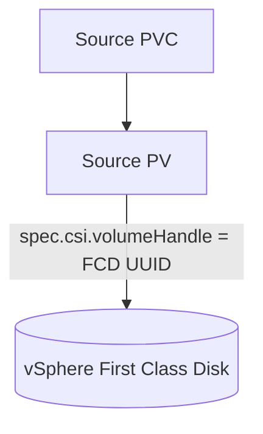
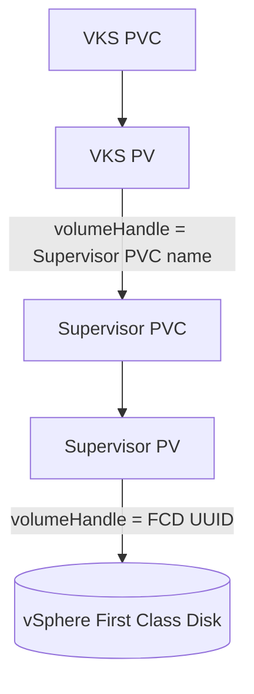
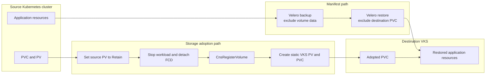

# Migrating vSphere CSI-based Kubernetes Workloads to VKS

## Overview

This validated solution demonstrates how to migrate a stateful workload from a Kubernetes cluster using the vSphere CSI driver—for example, OpenShift, upstream Kubernetes or TKGi—to VMware vSphere Kubernetes Service (VKS), while preserving the existing vSphere First Class Disk (FCD).

The migration has two independent paths:

1. **Application metadata** is backed up and restored with Velero.
2. **Persistent storage** is adopted into the destination Supervisor with `CnsRegisterVolume`, then exposed to the destination VKS cluster through a statically defined PersistentVolume and PersistentVolumeClaim.

The application data is not copied. The same FCD is detached from the source cluster and registered for use through the VKS storage hierarchy.

> [!CAUTION]
> This procedure transfers ownership of an existing FCD. Quiesce the application, protect the volume, confirm that it is detached from the source cluster and rehearse rollback before using the procedure with production data.

## Repository contents

```text
.
├── README.md
├── OCP-VKS-migration-example.md
├── zero-copy-migration-poc-script.sh
├── velero-destination-configmap-modifier-examples.md
└── quick-s3-endpoint-for-testing.md
```

- [`OCP-VKS-migration-example.md`](OCP-VKS-migration-example.md) contains the detailed OpenShift-to-VKS procedure.
- [`zero-copy-migration-poc-script.sh`](zero-copy-migration-poc-script.sh) provides a compact proof-of-concept implementation.
- [`velero-destination-configmap-modifier-examples.md`](velero-destination-configmap-modifier-examples.md) shows examples of destination-side resource translation.
- [`quick-s3-endpoint-for-testing.md`](quick-s3-endpoint-for-testing.md) creates a temporary S3-compatible endpoint for lab testing.

## When to use this approach

Use this workflow when:

- The source PV is provisioned by `csi.vsphere.vmware.com`.
- The source and destination use the same vCenter-managed FCD, or the FCD has already been migrated into the destination vCenter.
- The destination Supervisor supports the `CnsRegisterVolume` custom resource.
- A maintenance window is available to stop writes and detach the volume from the source cluster.
- Reusing the existing disk is preferable to copying the filesystem into a newly provisioned destination volume.

This workflow is not suitable when the source volume must remain mounted and writable during migration, when the destination cannot access the FCD, or when storage transformation requires a filesystem-level copy.

## Storage architecture

### Source Kubernetes cluster

In a conventional vSphere CSI cluster, the PV's CSI `volumeHandle` directly identifies the backing FCD:



### Destination VKS cluster

VKS uses a para-virtualised storage path. The VKS PV refers to a Supervisor PVC; the corresponding Supervisor PV refers to the FCD:



`CnsRegisterVolume` reconstructs the Supervisor portion of this chain around the existing FCD.

## Migration architecture

The manifest and storage paths are deliberately separated:



The two paths converge when the restored workload mounts the statically created destination PVC.

## Migration phases

### 1. Discover and validate

Identify the source namespace, PVC, PV, FCD UUID, capacity, access mode, volume mode, filesystem type and StorageClass. Confirm that the destination Supervisor namespace has an appropriate storage policy and that `CnsRegisterVolume` is available.

### 2. Protect the source volume

Create a CSI `VolumeSnapshot` where supported. The snapshot is a rollback safeguard; it is not used to move the data.

### 3. Back up application metadata

Use Velero to capture namespaced application resources without snapshotting volume data. Restore those resources into the destination namespace while excluding PVCs, because the destination PVC will be created separately around the adopted FCD.

### 4. Quiesce and detach

Stop all writers, set the source PV reclaim policy to `Retain`, delete the source PVC and wait until the source `VolumeAttachment` has disappeared. Do not register an FCD that remains attached to a source node.

### 5. Register the FCD with the Supervisor

Create a `CnsRegisterVolume` resource in the destination Supervisor namespace. When registration succeeds, the Supervisor creates a new PVC/PV pair whose backing volume is the original FCD.

### 6. Expose the volume to VKS

Create a static VKS PV whose CSI `volumeHandle` is the **Supervisor PVC name**, not the FCD UUID. Bind a static VKS PVC to this PV.

### 7. Validate and complete cutover

Confirm that the VKS PVC is bound, mount it in a validation pod, verify known data, then start the migrated workload. Retain source rollback objects until application validation is complete.

## Key safety rules

- **Snapshot before destructive changes**, where a compatible snapshot class is available.
- **Set the source PV to `Retain` before deleting the source PVC.**
- **Stop every writer before detaching the FCD.** Scaling Deployments alone may not stop StatefulSets, Jobs, standalone Pods or operators.
- **Wait for source `VolumeAttachment` removal.** Do not assume deletion of the PVC immediately detaches the disk.
- **Do not use the FCD UUID as the VKS PV `volumeHandle`.** The VKS PV must reference the Supervisor PVC created by `CnsRegisterVolume`.
- **Do not remove source PV finalizers as routine cleanup.** Delete the retained source PV only after destination validation; forcibly removing finalizers should be an exceptional recovery action.
- **Keep rollback assets until sign-off.** This includes the source snapshot, retained source PV metadata and the recorded FCD UUID.

## Example `CnsRegisterVolume`

```yaml
apiVersion: cns.vmware.com/v1alpha1
kind: CnsRegisterVolume
metadata:
  name: register-application-data
  namespace: destination-supervisor-namespace
spec:
  volumeID: "2c5999e4-e4a7-4cf8-9220-ac9f2d04f4b1"
  accessMode: ReadWriteOnce
  pvcName: data-volume-adopted
```

Wait for registration and inspect any reported error:

```bash
kubectl --kubeconfig="${SUPERVISOR_KUBECONFIG}" \
  -n destination-supervisor-namespace wait \
  --for=jsonpath='{.status.registered}'=true \
  cnsregistervolume/register-application-data \
  --timeout=5m

kubectl --kubeconfig="${SUPERVISOR_KUBECONFIG}" \
  -n destination-supervisor-namespace get \
  cnsregistervolume/register-application-data \
  -o jsonpath='{.status.error}{"\n"}'
```

## Validation checklist

- Source application is stopped and no writers remain.
- Source PV reclaim policy is `Retain`.
- Source `VolumeAttachment` no longer exists.
- `CnsRegisterVolume.status.registered` is `true`.
- The created Supervisor PVC is `Bound`.
- The Supervisor PV `volumeHandle` matches the captured FCD UUID.
- The VKS PV points to the Supervisor PVC name.
- The VKS PVC is `Bound`.
- A validation pod can mount and read the expected data.
- The restored workload starts successfully and passes application checks.

## Limitations and assumptions

| Item | Notes |
|---|---|
| Status | Example validated-solution workflow; test against the exact VCF, Supervisor, CSI and source-platform versions in use. |
| Data movement | No filesystem copy occurs. The existing FCD is re-registered. |
| Downtime | Required while the source is quiesced, detached and adopted by VKS. |
| Source storage | Must be a vSphere CSI block volume represented by an FCD. |
| Access mode | Examples use `ReadWriteOnce`; adapt only where the source and destination support the required mode. |
| Destination API | The Supervisor must provide `CnsRegisterVolume`. |
| Storage policy | The destination Supervisor namespace must permit a policy compatible with the FCD. |
| Cross-vCenter use | Requires the FCD to be migrated to the destination vCenter before registration. |
| Application translation | Images, ingress classes, security settings, StorageClasses and operators may require destination-specific changes. |

## Worked example

See [`OCP-VKS-migration-example.md`](OCP-VKS-migration-example.md) for a complete OpenShift-to-VKS walkthrough.

## Related documentation

This repository accompanies the VMware whitepaper on migrating Kubernetes workloads to VKS. Validate the procedure against current product documentation and support guidance before production use.
